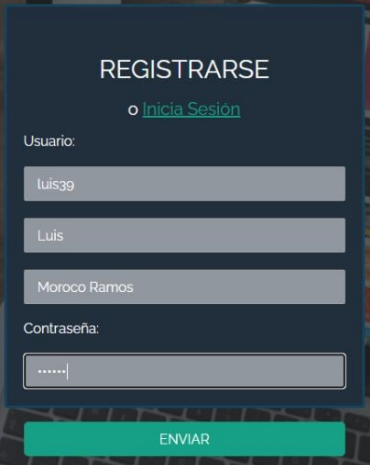

# CS Inventory
_PROYEFCTO FINAL DESARROLLO BASADO EN PLATAFORMAS_  
_La aplicación web ayudara a llevar la relación de los bienes que hay en una istitución, empresa o un negocio; con el fin de mantener ordenado y clasificado cada objeto, puesto que es una labor tediosa y con poco personas para que se encargan de ello._  
_Para el manejo de cada uno de los bienes u objetos se utilizara un código de barras, asi podremos controlar la entrda y salida de los bienes. Las personas que tendran acceso a la aplicación web serán unicamente los administradires, los cuales pueden modificar las características de los bienes y entre otras opciones mas; pero un usuario normal, solo podra observar las caracteríticas de los bienes._

# Descripción

  

_La aplicación web es de facil acceso y facil de interactuar, como pantallama de inicio tenemos la bienvenida y opción de comenzar, asi mismo en la misma pantalla, en la parte inferior derecha, tenemos dos opciones, Iniciar seción o Resgistrarse_

  

_En la parte inferior de la página de inicio tenemos las funcionalidades del inventario, y tambien los contactos._ 

* REGISTRARSE , en esta opción puedes ingresar tus datos incluida tu contraseña, el cual podras usarla para ingresar a la aplicación las veces que quieras. 

  

* INICIAR SECION , en esta opción nos piden los datos que anteriormente ya usamos para registrarnos.

  

_Ya en la PÁGINA DE INICIO tendremos opciones, buscar, llevar un control pero esto incluye datos de tipo Fecha y hora para saber la hora exacta de creación y modificación,pero eso viene por defecto y tambien borrar registro_ 

  

_Los bienes son guardados exitosamente por los administradores y los demás usuarios
pueden verlos, los campos de las tablas son en extremo necesarias y requeridas para el
correcto grabado en la base de datos pues nos indicarán con exactitud lo más importante
a la hora de guardar un objeto_ 

  

# Autores
